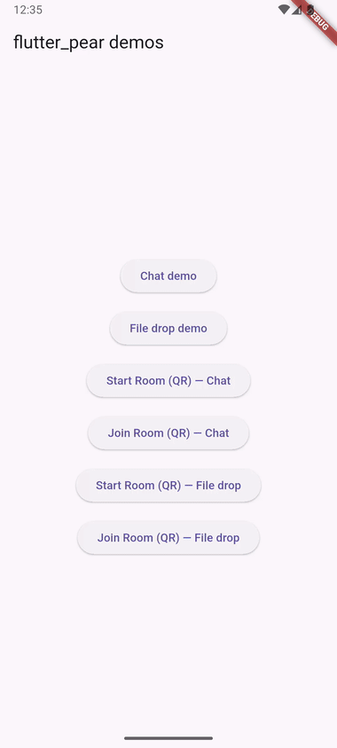

# flutter_pear

The full [Pear](https://pears.com/) peer-to-peer stack as a Dart-idiomatic Flutter plugin. Build serverless, end-to-end-encrypted P2P apps — discovery, encrypted connections, append-only logs, key/value stores, file drives, and multi-writer sync — without writing a line of Kotlin, Swift, or JavaScript.



> **Platforms:** Android (stable, published) · iOS (new in 0.2.0, **SIMULATOR-VALIDATED** — see [iOS platform notes](packages/flutter_pear/doc/ios.md) before shipping). Requires Flutter SDK ≥ 3.24 (bundles Dart ≥ 3.5).
>
> **Status: pre-1.0, published on pub.dev (v0.0.1).** Read [What works today](#what-works-today) below before assuming anything here is vaporware — the worklet is real, not a stand-in, and most of the API is already implemented and tested.
>
> Something stuck? Check [Troubleshooting](packages/flutter_pear/doc/troubleshooting.md) — install-time failures (slow/silent downloads, blocked fetches, checksum/ABI mismatches, manifest-merge conflicts) all have a symptom-first fix there. Still stuck? [Open an issue](https://github.com/andrewloable/flutter_pear/issues).
>
> Unofficial. Not affiliated with [Holepunch](https://holepunch.to/).

## Why

Pear (Bare + Hyperswarm + the Hypercore family) is a complete toolkit for building apps with no servers and no central authority. Its native surface is JavaScript. `flutter_pear` puts a typed Dart API in front of it so a Flutter dev gets Pear's guarantees with Flutter's ergonomics: `Future`s for calls, broadcast `Stream`s for events, `Uint8List` for bytes.

The design principle: **all P2P logic runs in JavaScript inside a bundled [Bare](https://github.com/holepunchto/bare) worklet; your Dart code is a typed remote control.** You never see the JS.

## What works today

flutter_pear is under active, incremental development — here's the honest breakdown of what actually runs versus what's still ahead, so you can tell the difference before relying on any of it.

- **The Bare Kit worklet is real, not a stand-in.** `Pear.start()` boots an actual Bare runtime running the bundled `pear-end` JS — not a native echo. This has been code-reviewed and confirmed with a live Hyperswarm join/relay round trip between two independent processes — an Android emulator and a desktop peer (see the pairing-combo matrix below). **This gate is emulator-based, not physical-hardware** (developer decision: no physical Android devices are available in this dev environment, so acceptance criteria were permanently downgraded to emulator-based validation). Physical **two-device** hardware validation (real phone ↔ real phone) remains valuable and is tracked for a final pass if hardware becomes available, but is no longer a precondition for this release. See [project_plan.md](project_plan.md) for the full milestone breakdown.
- **Every capability in the table below has a complete Dart wrapper and a complete, real `pear-end` JS implementation** — no stubs. Each is exhaustively unit/e2e-tested against `flutter_pear_test`'s in-memory fake (every happy path and every typed error path), plus emulator-based real-worklet validation where applicable.
- **What hasn't happened for any of them: a real-hardware (physical phone) run.** Each wrapper's own "does the fake match the real worklet, and does two-device replication actually converge" question was answered on emulators, not physical devices — tracked centrally in `flutter_pear-doi` as a nice-to-have follow-up, not a release blocker.
- **iOS is new in 0.2.0, simulator-validated.** The Bare Kit worklet boots and runs on the iOS Simulator against the real, committed `pear-end` bundle — verified with a live cross-platform round trip (simulator-iOS ↔ physical Android). Physical-iPhone validation is a documented follow-up, not a release gate (standing decision: sim-tier validation ships). See [iOS platform notes](packages/flutter_pear/doc/ios.md) for what's actually different on iOS: background execution, the Local Network permission (the single biggest sim-invisible risk), and storage roots.
- **Published on pub.dev.** `flutter_pear`, `flutter_pear_bare`, and `flutter_pear_test` are all live at v0.0.1.

## Install

```bash
flutter pub add flutter_pear
```

Native binaries and the P2P runtime resolve automatically — Gradle on Android, SwiftPM (with a CocoaPods compat path) on iOS. No manual NDK, ABI, or Podfile edits on either platform.

Pre-1.0: **minor versions may break the API without notice.** Pin an exact version once you depend on this for real.

**Time to hello world (TTHW):** P50 ≤ 5 minutes / P90 ≤ 10 minutes of active work, zero `flutter_pear`-specific build-wiring steps beyond one copy-paste `Info.plist` block on iOS — "hello world" means the first Android-to-iOS message, not just a successful build.

First-build download UX (native binaries fetch once, then cache):

- **Android:** downloads Bare Kit's native binaries, cached under each app's `build/flutter_pear_bare/bare-kit/`; delete that directory, or run `flutter clean`, to force a re-download.
- **iOS (SwiftPM, the default):** downloads the repacked `BareKit.xcframework` (~107 MB), cached under `~/Library/Caches/org.swift.swiftpm`; delete that directory, or run `flutter clean`, to force a re-download.
- **iOS (CocoaPods compat path):** downloads the same artifact into `ios/Pods/flutter_pear_bare/barekit_cache/<version>/`; delete `ios/Pods/` and re-run `pod install` to force a re-download.

Both platforms fetch from the same upstream [holepunchto/bare-kit](https://github.com/holepunchto/bare-kit) release; iOS's SwiftPM/CocoaPods binary-target mechanisms need a single ready-made `BareKit.xcframework` zip rather than Android's raw ~354 MB multi-platform `prebuilds.zip`, so `flutter_pear` republishes just that one framework, repacked and checksum-pinned — see [`barekit-pin.json`](packages/flutter_pear_bare/barekit-pin.json) for the exact pin chain.

**Download-size disclosure** (accept-and-disclose, standing decision — pub.dev downloads every dependency's committed files regardless of your target platform, [flutter/flutter#130210](https://github.com/flutter/flutter/issues/130210)): `flutter_pear_bare`'s committed iOS addon `.xcframework`s (bundled for every consumer, Android-only included) add **~21 MB** to that package's own tracked content — measured directly (`git ls-files` + `du`), not a pub.dev-computed archive size (this repo's `dart pub publish --dry-run` doesn't emit that line in this environment; a repo maintainer with pub.dev publish access should re-measure and correct this number at release time if it drifts). The example app's iOS build produces a `Runner.app` of **~59.7 MB** (measured on the simulator archive) — this is an absolute number, not a delta: v0.1 had no iOS build at all to diff against.

## Quick start — chat over Hyperswarm

Two phones that share a topic find each other over the internet and exchange end-to-end-encrypted messages, no server:

```dart snippet
import 'dart:convert';
import 'package:flutter_pear/flutter_pear.dart';

final pear = await Pear.start();

// A topic is a 32-byte rendezvous key both peers agree on out of band.
// unsafeTopicFromString is a GLOBAL, demo-only shortcut -- every device
// worldwide using the same string lands in the same room. Real apps
// derive a topic from a PearPairing invite instead (see the coverage
// table below).
final topic = PearCrypto.unsafeTopicFromString('my-secret-room');
final swarm = await pear.join(topic);

swarm.connections.listen((PearConnection conn) {
  conn.data.listen((bytes) {
    print('peer: ${utf8.decode(bytes)}');
  });
  conn.write(utf8.encode('hello from Flutter'));
});

// ... later
await swarm.leave();
await pear.dispose();
```

Expected output on each phone, once the other side's message arrives:

```
peer: hello from Flutter
```

Everything is `Future`s and `Stream`s; keys are a `PearKey` value type with hex helpers (z-base-32 is planned, not yet implemented).

## Enable iOS on an existing Android app

Already on `flutter_pear` 0.1.x, Android-only? Five steps get you to iOS:

1. `flutter create --platforms=ios .` — plain Flutter, nothing `flutter_pear`-specific.
2. `flutter pub add flutter_pear:^0.2.0` — explicit, not a bare `flutter pub upgrade`: that command cannot cross the already-published `^0.0.1` caret. If you previously pinned `flutter_pear_bare` directly in your own `pubspec.yaml`, bump it the same way; if `pub add` reports a stale lock conflict, delete `pubspec.lock` and re-resolve.
3. Paste this into `ios/Runner/Info.plist` (copied from [`doc/ios.md`](packages/flutter_pear/doc/ios.md#local-network-permission--the-top-sim-invisible-risk) — see that page for why, and for the full symptom table if you skip this step):
   ```xml
   <key>NSLocalNetworkUsageDescription</key>
   <string>flutter_pear demos connect directly to your other devices over the local network to exchange chat messages and files.</string>
   ```
   Adjust the description to your own app's actual local-network use — Apple requires it be accurate, not necessarily this exact wording.
4. `flutter run` on an iOS Simulator.
5. Exchange your first message with an Android peer — same `Pear.start()`/`join()` code as above, no platform branching required for the happy path.

**Received-file locations** (if your app uses `PearDrive`/file transfer) differ by platform, matching what `flutter_pear_example`'s own file-drop demo does: **iOS** saves into a `Documents` subtree (`path_provider`'s `getApplicationDocumentsDirectory()`), visible in the Files app; **Android** saves into the app's private files directory (`Context.getFilesDir()/received/`), not independently visible — open or share it through your app's own affordance (a `FileProvider` content URI + `ACTION_VIEW`, in the example app's case). Neither location is where the worklet's own protocol storage lives — see [Storage roots](packages/flutter_pear/doc/ios.md#storage-roots-deliberately-non-configurable) for that.

## API coverage

| Capability | Dart class | Status |
|---|---|---|
| Bare worklet lifecycle | `BareWorklet` | Real worklet boots + runs, emulator-verified; two-device hardware proof pending |
| Discovery + encrypted connections (Hyperswarm) | `PearSwarm`, `PearConnection` | Implemented, fake-tested; hardware proof pending |
| Keypairs, topics, hashes | `PearCrypto` | SHA-256 topics/hashes implemented; real per-device keypairs not yet exposed (untracked, not gating v0.1 — `PearPairing` already covers real key exchange for invites) |
| Append-only logs (Corestore / Hypercore) | `PearStore`, `PearCore` | Implemented, fake-tested; hardware proof pending |
| Key/value store (Hyperbee) | `PearBee` | Implemented, fake-tested; hardware proof pending |
| File drive + mirror-to-disk (Hyperdrive) | `PearDrive` | Implemented, fake-tested; hardware proof pending |
| Multi-writer sync (Autobase, prebuilt recipes) | `PearBase` | Implemented, fake-tested; hardware proof pending |
| Invites / device linking (blind pairing) | `PearPairing` | Implemented, fake-tested; hardware proof pending |

"Hardware proof pending" means real-worklet/physical-device validation is deliberately deferred to one final pass (see [What works today](#what-works-today)) — the automated test suite for every row above is green today.

App lifecycle (suspend/resume) is auto-wired to `AppLifecycleState` and overridable — see [Background execution](#background-execution).

## Learn more

- [Concepts](packages/flutter_pear/doc/concepts.md) — topics vs. invites (read this before you ship `unsafeTopicFromString` anywhere real), the worklet model, replication, lifecycle.
- How-tos: [chat](packages/flutter_pear/doc/howto-chat.md), [file sync](packages/flutter_pear/doc/howto-filesync.md), [pairing](packages/flutter_pear/doc/howto-pairing.md) — complete, copy-pasteable walkthroughs with expected output.
- [Error catalog](packages/flutter_pear/ERRORS.md) — every error code's problem, cause, and fix.
- [Troubleshooting](packages/flutter_pear/doc/troubleshooting.md) — install-time failures (Gradle fetch, checksum, ABI, manifest merge) that runtime error codes can't catch.

## Testing your app

`flutter_pear_test` ships in-memory fakes for the full API — swarm, Corestore/Hypercore, Hyperbee, Hyperdrive, Autobase, and blind pairing — so you can unit-test your P2P logic without radios or real peers.

## Background execution

iOS and Android aggressively suspend background apps, which can drop swarm connections. `flutter_pear` wires suspend/resume to the app lifecycle by default; [`packages/flutter_pear/BACKGROUND_EXECUTION.md`](packages/flutter_pear/BACKGROUND_EXECUTION.md) covers what Android actually permits (foreground service, OS suspend timing), and [`packages/flutter_pear/doc/ios.md`](packages/flutter_pear/doc/ios.md#background-execution-on-ios) covers iOS's own story (a native suspend fix that transitions cleanly, but no extended background execution) so you can set expectations correctly on either platform. Branch app behavior on `Pear.platformInfo.backgroundExecution`, not a platform check.

## Development setup

This is a [melos](https://melos.invertase.dev/) monorepo. To work on it you need:

- **Flutter SDK ≥ 3.24** (bundles Dart ≥ 3.5)
- **Melos ≥ 6** — `dart pub global activate melos`
- **JDK 17 + Android SDK/NDK** to build the plugin and Android example
- **Xcode + CocoaPods** to build the plugin and iOS example (simulator-tier validation; see [iOS platform notes](packages/flutter_pear/doc/ios.md))
- **Node.js ≥ 18 + npm**, plus **bare-pack** (`npm i -g bare-pack`) *only* if you change the `pear-end/` worklet JS

```bash
melos bootstrap        # link packages + pub get
melos run analyze
melos run test --no-select
```

The example's Android runner is checked in — no `flutter create` hydrate step. Two-device chat demo:

```bash
flutter devices                       # note the device IDs for both phones/emulators
cd packages/flutter_pear_example
flutter run -d <device-id-A>          # terminal 1 -- phone/emulator A
flutter run -d <device-id-B>          # terminal 2 -- phone/emulator B
```

Enter the same room name on both, tap **Join** — messages sent on one appear on the other, with the connection-state banner (discovering/connecting/connected/failed) visible the whole time.

**Pairing-combo matrix (honest — tested, not assumed):**

| Combo | Result | Note |
|---|---|---|
| Emulator ↔ desktop peer (`tool/peer.js`) | ✅ Works | Confirmed: DHT discovery, Noise handshake, and a real message round trip between an Android emulator and a plain desktop process. This is the recommended one-machine dev path — see below. |
| Emulator ↔ emulator (same host) | ❌ Fails | Two emulators sharing one host's virtualized network NAT identically, which breaks the UDP hole-punching Hyperswarm's DHT-based discovery relies on — confirmed and reproduced across multiple sessions, root-caused, not a flutter_pear bug. Two emulators on the *same host* are not a supported dev path; use the desktop-peer path instead. |
| Device ↔ device, device ↔ emulator, device ↔ desktop peer | ⏳ Untested | No physical Android hardware was available when this matrix was produced. Expected to work (real phones use standard NAT traversal, not the emulator-specific virtualization artifact above) but not yet confirmed — tracked for the final hardware-validation pass. |

So: **for local dev on one machine, use the desktop-peer path below, not a second emulator.**

**One-phone path:** only one physical/emulated Android device? `flutter_pear_example` ships a desktop CLI peer that joins the same room from your laptop instead of a second phone (an emulator's NAT often breaks UDP hole-punching a real second device wouldn't hit; this also doubles as a scriptable peer for CI):

```bash
cd packages/flutter_pear_example
dart run flutter_pear_example:peer --topic my-secret-room   # same room name as the phone
```

Type a line + Enter to send once it connects; incoming messages print as `peer: <message>`. Exits with a nonzero code if no peer connects within `--timeout <seconds>` (default 30), so it's usable as a CI assertion. It runs as a plain Node process (see `tool/peer.js`'s own doc for why), reusing the exact Hyperswarm version pear-end bundles for the worklet — no separate install beyond the Node.js already required for `pear-end/`.

**Doctor:** `dart run flutter_pear:doctor` (from `packages/flutter_pear`) runs runtime connectivity diagnostics — real Hyperswarm DHT bootstrap reachability, a NAT/firewall estimate, and a local two-process loopback self-test — printing a `[PASS]`/`[FAIL]`/`[INFO]` line per check and naming the blocker (with a docs anchor) on a UDP-blocked network instead of shrugging. It's desktop-side network diagnostics, not a real worklet boot: a plain `dart run` CLI has no Flutter engine to drive `BareWorklet`'s platform channels the way a real app does, so that check only runs if a `bare` CLI is on `PATH`, else it's reported as an explicit skip.

**Release packaging (E4.5):** `flutter build appbundle --release` and `flutter build apk --release --split-per-abi` both build and run correctly — verified on a real arm64-v8a Android emulator (release-mode R8/native-lib loading, not just debug). Both artifact types include a 32-bit `armeabi-v7a` variant by default that is **missing this plugin's native libraries entirely** (Flutter's own ABI splitting has no way to know a dependency only ships arm64-v8a/x86_64 binaries) — installing that specific variant on a device that reports `armeabi-v7a` support (a real 32-bit device, or an ARM-translation layer) fails fast with a clear error at worklet-start time instead of a cryptic native-loader crash; it is not a supported configuration. Always ship the `arm64-v8a`/`x86_64` splits (or let an app bundle's per-device delivery pick one of those).

## Contributing

Roadmap and design rationale live in [project_plan.md](project_plan.md). The low-level `flutter_pear_bare` core is deliberately small; the per-data-structure packages (`PearBee`, `PearDrive`, `PearBase`, …) are the best places to contribute.

## License

flutter_pear is **MIT** © 2026 Andrew Loable — see [LICENSE](LICENSE).

It bundles the Pear stack (Bare Kit + Hyper\* modules), which is **MIT /
Apache-2.0** — all permissive, no copyleft. Redistributed attributions ship in
`THIRD_PARTY_LICENSES` (generated at build time). See [LICENSING.md](LICENSING.md)
for the full dependency breakdown and obligations.
